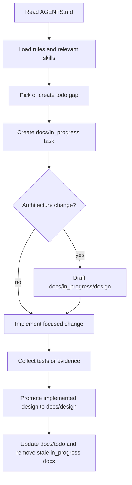

# Agent Harness Source Reading Report

- **Date**: 2026-04-20
- **Purpose**: Extract durable agent-harness practices for the clean IntelliC branch.

## Sources

- `.references/areal-vibe.pdf`
- `https://www.inclusion-ai.org/AReaL/en/reference/ai_assisted_dev.html`
- `.repositories/AReaL`
- `.repositories/pypto`
- `.repositories/simpler`
- `origin/htp/v0`

## Source Scope Map

| Source | Scope Read | Useful Shape | IntelliC Use |
| --- | --- | --- | --- |
| AReaL PDF and docs | Agent-assisted development workflow | Rules, skills, and expert profiles as durable memory | `.agents/rules/`, `.agents/skills/`, `.agents/agents/` |
| `.repositories/AReaL` | Repo-local agent harness layout | Layered agent instructions with examples and workflows | Clean `.agents/` scaffold |
| `.repositories/pypto` | Compiler-adjacent repo workflow | Environment isolation, build discipline, examples | Security/environment and verification rules |
| `.repositories/simpler` | Python project conventions | Local setup, tests, and examples | Simple clean-branch package conventions |
| `origin/htp/v0` | Prior project docs lifecycle | Active design/task docs plus implemented docs | `docs/in_progress/`, `docs/design/`, `docs/todo/` lifecycle |

## Visual Model

```text
AGENTS.md
  |
  v
.agents/README.md
  |
  +--> .agents/rules/      mandatory project rules
  +--> .agents/skills/     executable workflows
  +--> .agents/agents/     read-only expert profiles
  `--> .agents/templates/  repeatable document shapes

docs/
  |
  +--> notes/        source readings and evidence
  +--> in_progress/  active tasks and design drafts
  +--> todo/         future or partial work
  `--> design/       implemented behavior only
```

## Lifecycle Flowchart



## Policy Sketches

Harness directory rule:

```text
allowed:    .agents/
prohibited: .codex/ .claude/ .opencode/
reason:     clean branch must not depend on tool-specific hidden harnesses
```

Docs lifecycle rule:

```text
if design is proposed but not implemented:
    write docs/in_progress/design/<topic>.md
if behavior is implemented:
    promote durable content into docs/design/
if task closes:
    remove stale docs/in_progress files
```

Verification rule:

```text
completion_claim requires fresh command output
feature_task requires explicit input, output, verification
PR requires tests or documented reason tests are impossible
```

## Source Comparison

| Concern | AReaL Pattern | v0 Pattern | Clean IntelliC Decision |
| --- | --- | --- | --- |
| Root instructions | Short router | Mixed project instructions | Keep `AGENTS.md` concise |
| Agent memory | Rules/skills/profiles | Docs plus policy scripts | Use `.agents/` plus `docs/` |
| Source readings | External references | `docs/reference` and `docs/research` | Commit curated `docs/notes` only |
| Active work | Workflow docs | `docs/in_progress` lifecycle | Preserve lifecycle with stale-doc check |
| Verification | Evidence-oriented agent workflow | PR policy checks and examples | Enforce harness shape in `scripts/check_repo_harness.py` |

## Extracted Lessons

- Keep root agent instructions short and route detailed guidance into smaller files.
- Use rules, skills, expert profiles, and design docs as persistent cross-session memory.
- Require explicit input, output, and verification criteria for every feature task.
- Treat evidence, minimal demos, and tests as the contract between human and agent.
- Keep local reference PDFs and cloned repositories ignored; commit only curated reading reports.
- Preserve the v0 docs lifecycle: active drafts in `docs/in_progress/`, implemented design in `docs/design`, and open gaps in `docs/todo/`.

## Decisions Affected

- Use `.agents/` as the only repo-local agent harness directory.
- Use `docs/notes/` for all document and repository reading reports.
- Ban `.codex/`, `.claude/`, and `.opencode/` from the clean branch scaffold.
- Add policy checks for harness shape and stale in-progress design drafts.

## Follow-Up Evidence

- `scripts/check_repo_harness.py` checks required harness directories,
  prohibited tool-specific directories, approved docs entries, ignored local
  references, and stale in-progress design drafts.
- `tests/test_repo_harness.py` exercises clean scaffold success, prohibited
  harness directory failure, stale design failure, design-example policy, and
  notes richness policy.
- Future harness changes should add one policy test before changing the checker
  or rules.
